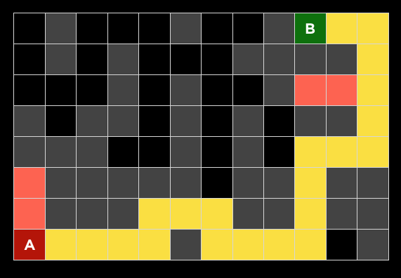
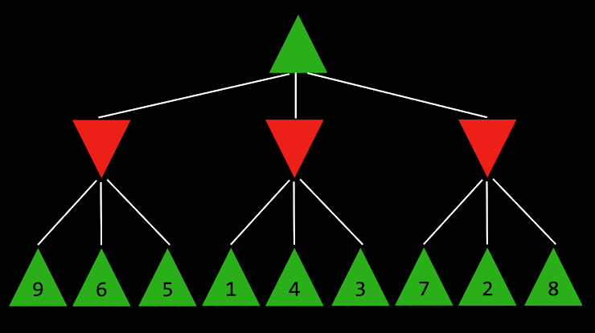

# Quiz - 1

1. Between depth first search (DFS) and breath first search (BFS), which will find a shorter path through a maze?

    * [ ] DFS will always find a shorter path than BFS
    * [ ] BFS will always find a shorter path than DFS
    * [ ] DFS will sometimes, but not always, find a shorter path than BFS
    * [X] BFS will someetimes, but not always, find a shorter path than DFS
    * [ ] Both algorithms will always find paths of the same length

2. [WRONG] The following question will ask you about the below maze. Grey cells indicate walls. A search algorithm was run on this maze, and found the yellow highlighted path from point A to B. In doing so, the red highlighted cells were the states explored but that did not lead to the goal.

    

    Of the four search algorithms discussed in lecture — depth-first search, breadth-first search, greedy best-first search with Manhattan distance heuristic, and A* search with Manhattan distance heuristic — which one (or multiple, if multiple are possible) could be the algorithm used?

    * [ ] Could only be A*
    * [ ] Could only be greedy best-first search
    * [ ] Could only be DFS
    * [ ] Could only be BFS
    * [X] Could be either A* or greedy best-first search
    * [ ] Could be either DFS or BFS
    * [ ] Could be any of the four algorithms
    * [ ] Could not be any of the four algorithms

3. Why is depth-limited minimax sometimes preferable to minimax without a depth limit?

    * [X] Depth-limited minimax can arrive at a decision more quickly because it explores fewer states
    * [ ] Depth-limited minimax will achieve the same output as minimax without a depth limit, but can sometimes use less memory
    * [ ] Depth-limited minimax can make a more optimal decision by not exploring states known to be suboptimal
    * [ ] Depth-limited minimax is never preferable to minimax without a depth limit

4. [WRONG] The following question will ask you about the Minimax tree below, where the green up arrows indicate the MAX player and red down arrows indicate the MIN player. The leaf nodes are each labelled with their value.

    

    What is the value of the root node?

    * [ ] 2
    * [ ] 3
    * [X] 4
    * [ ] 5
    * [ ] 6
    * [ ] 7
    * [ ] 8
    * [ ] 9
