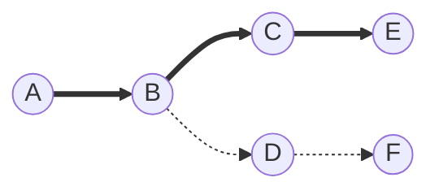

# Search Problems

## Terminology

* **agent**: An agent is just some entity that perceives its environment, it somehow is able to perceive the things around it, and act on that environment in some way.
* **state**: A state is just some configuration of the agent in its environment.
* **action**: Actions are just choices that the agent can make in any given state, mathematically, defined as functions.
* **transition model**: A description of what state we get after we perform some available action in some other state. This function called `result(state, action)` takes two inputs with the output being the state that we get after performing action $A$ in state $S$.

## Anatomy of a search problem

* initial state
* actions
* transition model
* goal test
* path cost function

## Solution Types

* **solution**: A sequence of actions that leads from the initial state to a goal state.
* **optimal solution**: A solution that has the lowest path cost among all solutions.

## Nodes

A **node** is a data structure that keeps track of:

* a state
* a parent (node that generated this node)
* an action (action applied to parent to get node)
* a path cost (from initial state to node)

## Frontier

The **frontier** is the amount of possible states that are available from the current state. Often times, when a new state is achieved, more frontiers will become available.

## Approach

* Start with a frontier that contains the initial state.
* Repeat:
  * If the frontier is empty, then no solution.
  * Remove a node from the frontier.
  * If node contains goal state, return the solution.
  * Expand node, add resulting nodes to the frontier.



## Revised Approach

* Start with a frontier that contains the initial state.
* Start with an empty explored set.
* Repeat:
  * If the frontier is empty, then no solution.
  * Remove a node from the frontier.
  * If node contains goal state, return the solution.
  * Add the node to the explored set.
  * Expand node, add resulting nodes to the frontier if they aren't already in the frontier or the explored set.

## Data Structures

* **stack**: last-in first-out data type
* **queue**: first-in first-out data type

## Search Algorithms

* **depth-first search**: search algorithm that always expands the deepest node in the frontier
* **breath-first search**: search algorithm that always expands the shallowest node in the frontier
* **uninformed search**: search strategy that uses no problem-specific knowledge (BFS, DFS)
* **informed search**: search strategy that uses problem-specific knowledge to find solutions more efficiently
* **greedy best-first search**: search algorithm that expands the node that is closest to the goal, as estimaded by a heuristic function $h(n)$, suce as the **Manhattan Distance** algorithm, which takes the shortest path between two points
* **A\* search**: search algorithm that expands node with lowest value of $g(n) + h(n)$
  * $g(n)$: cost to reach node
  * $h(n)$: estimated cost to goal
  * optimal if:
    * $h(n)$ is admissible (never overestimates the true cost)
    * $h(n)$ is consistent (for every node $n$ and successor $n'$ with step cost $c$, $h(n) \le h(n') + c$)
* **minimax**: algorithm where the outcomes are given a score and creates an advisarial agent against your agent
  * MAX (X) aims to maximize score
  * MIN (O) aims to minimize score

## Game

* $S_0$: initial state
* $PLAYER(s)$: returns which player to move in state $s$
* $ACTIONS(s)$: returns legal moves in state $s$
* $RESULT(s, a)$: returns state after action $a$ taken in state $s$
* $TERMINAL(s)$: checks if state $s$ is a terminal state
* $UTILITY(s)$: final numerical value for terminal state $s$

### Minimax

#### Pseudo Code

* Given a state $s$:
  * $MAX$ picks action $a$ in $ACTIONS(s)$ that produces the highest value of $MIN-VALUE(RESULT(s, a))$
  * $MIN$ picks action $a$ in $ACTIONS(s)$ that produces smallest value of $MAX-VALUE(RESULT(s, a))$

MAX Player:

```pseudo
function MAX-VALUE(state):
  if $TERMINAL(state):
    return UTILITY(state)
  v = -∞
  for action in ACTIONS(state):
    v = MAX(v, MIN-VALUE(RESULT(state, action)))
  return v
```

MIN Player:

```pseudo
function MIN-VALUE(state):
  if $TERMINAL(state):
    return UTILITY(state)
  v = ∞
  for action in ACTIONS(state):
    v = MIN(v, MAX-VALUE(RESULT(state, action)))
  return v
```

### Optimizations

* **Alpha-Beta Pruning**: algorithm where the value is determined for the first state, and then if the value for the second state is lower than the first, no more calculations are needed.
* **Depth-Limited Minimax**: algorithm where the depth of the calculations is limited to a set amount
  * **evaluation function**: function that estimates the expected utility of the game from a given state
